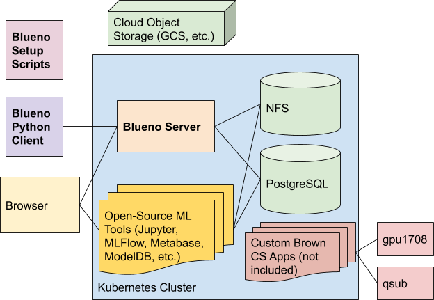

## Testing

First, install `dev-requirements` in a virtual environment. 

- If changing the server or registration pipelines, update the image
  to a Docker repo that you have write access to.
    - For `blueno-server`, update the image variable in `Makefile` and the
      image values in `k8s/server.yaml`,`k8s/server-dev.yaml`, and `k8s/worker.yaml`
- The `make test` command in `cluster/server/` tests the Blueno server locally.
- Running `make test` from `cluster` will deploy all of the
  apps in the existing cluster and check that the tests pass.
- Use `make dev` in `cluster/` to develop the web UI. The 
  app will be available from `localhost:5000`.

### Testing Status

- __Server__: The server has been tested to make sure that
  all functionality works as intended. The server
  has not been tested to see that 500 errors are
  not raised for common case errors. 
  `blueno-server` works but does not have user-friendly
  error messages yet.
- __Client__: The client has not been tested thoroughly. The
  `register_sample` and `create_sample` commands have
  been used extensively.
- __Setup__: The setup scripts were last run on 5/29/2019.
- __Register__: All registration scripts were last run on 5/27/2019.
 