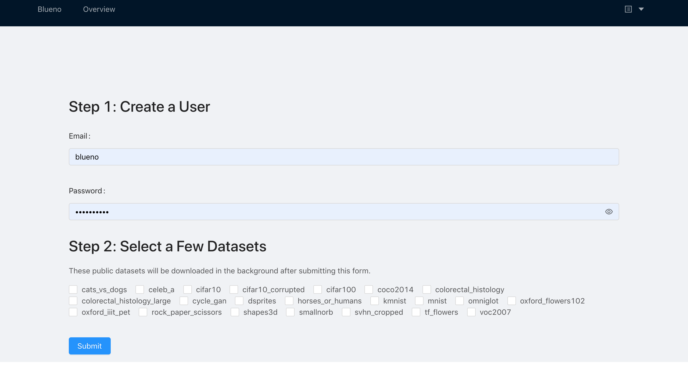
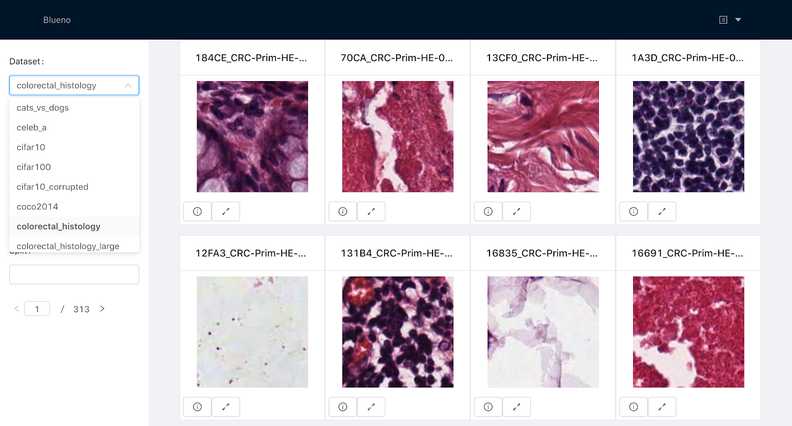
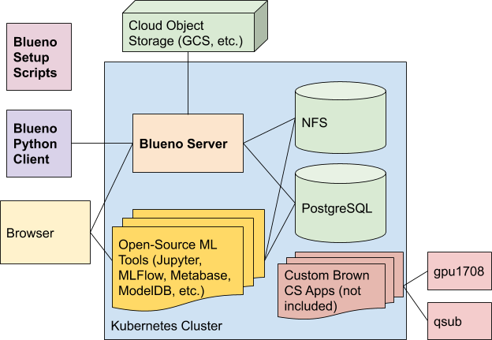

# Blueno: a Gateway Tool to Productive Deep Learning

Blueno is a tool that makes it easy to start training
deep learning models on image datasets.

To get started, run one of the scripts in `setup/` and then select a few
public datasets through the web UI. The data will be prepared in the background.
The smallest datasets take <10 minutes to prepare.
Smaller datasets like MNIST and CIFAR will be ready in 30-60 minutes.
Larger ones can take a day or two to download and prepare.

If you have your own image dataset, you can use the Python client to upload
your data.
Blueno actually works best for people doing transfer learning with smaller, real-world datasets.




_The dataset registration form and the UI for viewing the images_



_The setup scripts set up Postgres to store metadata and
 NFS to store image data. All applications run on Kubernetes._

This may seem like over-engineering, but it mitigates data problems in the field which are estimated to take [80%](https://www.infoworld.com/article/3228245/the-80-20-data-science-dilemma.html) or even
[90%](https://www.technologyreview.com/s/612897/this-is-why-ai-has-yet-to-reshape-most-businesses/) of a ML practitioner’s time.
If you hope to deploy a deep learning model, this would still not be enough. In that case, you'd want eventually add or move on to some of tools listed in [Why is this a "gateway" tool?](#why-is-this-a-gateway-tool)


In addition, Docker, Kubernetes, NFS, and Postgres make your team much more productive.
See [this doc](TECHNICAL_WHY.md) for a more technical discussion on the problems Blueno addresses.

# Table of Contents
- [Installation](#installation)
- [Usage](#usage)
- [Anticipated FAQs](#anticipated-faqs)

## Installation

_Note: These commands were only tested on MacOS. They may work on Linux and don't work on Windows_

All setup scripts require `kubectl` and `helm`
To install them on MacOS, run

```
brew install kubernetes-cli kubernetes-helm
```

See the [kubectl installation guide](https://kubernetes.io/docs/tasks/tools/install-kubectl/) and the [Helm installation guide](https://github.com/helm/helm/blob/master/docs/install.md) for
more installation information.

If you want to use Google Kubernetes Engine, make sure you have `gcloud` [installed](https://cloud.google.com/sdk/install) and run:
```
git clone https://github.com/luke-zhu/blueno.git
cd blueno
python3 setup/gke.py  # Takes ~10 minutes
kubectl get pods -w  # Ctrl+C when the blueno-server is RUNNING
kubectl get svc
```

Type in the _external IP_ of `blueno-nginx-nginx-ingress-controller` into your browser to navigate to the UI.

_Note: An core reason for building the tool on Kubernetes was because GKE's autoscaling feature basically allows you
to avoid managing your GPUs. All the small management tasks like starting/stopping GPU-accelerated nodes to save costs,
calculating how many extra nodes you need for batch jobs run at night, and updating drivers add up over time.
Unfortunately, both AKS and Minikube still require a bit more GPU management work.
See [setup/README.md](setup/README.md) for more details on their limitations._

If you want to use Azure Kubernetes Service, make sure you have the Azure CLI (`az`) [installed](https://docs.microsoft.com/en-us/cli/azure/install-azure-cli?view=azure-cli-latest) and run:
```
git clone https://github.com/luke-zhu/blueno.git
cd blueno
python3 setup/aks.py
kubectl get pods -w  # Ctrl+C when the blueno-server is RUNNING
kubectl get svc
```

If you want to use Minikube, make sure you `minikube` [installed](https://kubernetes.io/docs/tasks/tools/install-minikube/)
and run

_Note: Make sure to set the capacity field `cluster/nfs/pvc.yaml` to 13Gi first or to increase
the minikube disk size in `setup/minikube.py`._
```
git clone https://github.com/luke-zhu/blueno.git
cd blueno
python3 setup/minkube.py
kubectl get pods -w  # Ctrl+C when the blueno-server is RUNNING
minikube service blueno-nginx-nginx-ingress-controller
```

## Usage

We recommend that you use `kubectl` to submit training jobs, start jupyter notebooks, and view logs.

Here are some example commands:

```
kubectl get jobs  # see all running (registration) jobs
kubectl logs <POD_NAME>   # view the logs of a pod
kubectl apply -f cluster/extensions/jupyter/  # start up a CPU-only Jupyter notebook
kubectl port-forward deployment/blueno-jupyter 8888:8888  # port forward the jupyter notebook to localhost:8888
```

See the [Kubernetes docs](https://kubernetes.io/docs/) for more details on how to use Kubernetes and
[cluster/extensions/README.md](cluster/extensions/README.md) for commands to deploy notebooks and more

There is a fairly barebones Python client for interacting with the Blueno server.
See the `client/` directory for more details

```python
import blueno
client = blueno.PlatformClient('https://example.com', 'example@example.com', 'hunter2')
client.create_dataset('my-dataset', description='Pictures of trees and not-trees')
client.register_sample('sample1', 'my-dataset', 'gs://my-bucket/existing-npy-file.npy', image_type='2D')
with open('...', 'rb') as f:
    client.create_sample('sample2', 'my-dataset', 'file://data/my-dataset/sample2.npy', f, image_type='3D')
```

## Credits

_Special thanks to Ugur Cetintemel for sponsoring this project,
Andrew Kim for helping with the initial prototypes, and the rest of the [ELVO group](https://elvoai.github.io) for
helping test things out_.

## Anticipated FAQs

### Why is this a "gateway" tool?

There are many useful ML tools in the ecosystem that are not being used enough.
For example, it's arguable that every ML practitioner should be using an experiment tracking tool like [Mlflow Tracking](https://github.com/mlflow/mlflow#launching-the-tracking-ui),
[ModelDB](https://github.com/mitdbg/modeldb), and [Polyaxon Tracking](https://github.com/polyaxon/polyaxon#dashboard) to
automatically keep track of the models trained.

One issue preventing many people from using such tools is that installing the software does not seem to be worth the effort.
We believe that this tool can encourage ML researchers to use better tooling because
(1) this tool is (presumably) one of the simplest ways to start training models on a a public image dataset and
(2) this tool comes with simple examples of how to set up additional ML tools. See [cluster/extensions/README.md](cluster/extensions/README.md)
for instructions.

Here is a list of open-source tools worth considering:

- [Kubeflow](https://www.kubeflow.org/)
- [dvc](https://github.com/iterative/dvc)
- [Pachyderm](https://github.com/pachyderm/pachyderm)
- [Tensorflow Datasets](https://github.com/tensorflow/datasets)
- [Ludwig](https://uber.github.io/ludwig/)
- [ModelDB](https://github.com/mitdbg/modeldb)
- [Polyaxon](https://github.com/polyaxon/polyaxon)
- [Mlflow](https://github.com/mlflow/mlflow)
- [Cortex](https://github.com/cortexlabs/cortex)

Kubeflow, Pachyderm, and Polyaxon run on Kubernetes, so experience gained
using this platform would translate.

### Which public datasets are supported?

The following datasets from [Tensorflow Datasets](https://github.com/tensorflow/datasets)
can be prepared through the web form:

  - cats_vs_dogs
  - celeb_a
  - cifar10
  - cifar10_corrupted
  - cifar100
  - coco2014
  - colorectal_histology
  - colorectal_histology_large
  - cycle_gan
  - horses_or_humans
  - kmnist
  - mnist
  - omniglot
  - oxford_flowers102
  - oxford_iiit_pet
  - quickdraw_bitmap
  - rock_paper_scissors
  - smallnorb
  - svhn_cropped
  - tf_flowers
  - voc2007
  
Custom scripts for preparing ImageNet and LUNA16 may be released in the future.
  
### Is this the right tool for me?

Blueno is a great choice if:

- You want to quickly get started with one of the listed public image datasets.
- You are working with real-world image datasets with <20k samples.
- You are frequently preprocessing 2D or 3D image data and need a convenient way to view the resulting data. If you
    are working with CT scans, you would likely be doing this a lot.
- You are working with 1-10 other people and need a simple way to train models on the same data.
- You want something moderately cheap but you're budget is still large enough to use a few GPUs. You are fine with letting Kubernetes scale up and down to your resource demands.
- You plan to run a lot of batch preprocessing and training jobs. You want to run your own servers and cronjobs on Kubernetes.

Blueno is not a good choice if:

- You are frequently preprocessing with datasets containing hundreds of thousands of samples.
    The performance of Blueno is pretty bad and it takes more than an hour to upload such datasets.
- Your team does not want to manage any infrastructure at all. You would rather not troubleshoot issues with NFS or the Blueno server.
- Your organization already supplies you with strong ML infrastructure. 
- You are not working on the cloud and don't have any plans to in the future.

See [this doc](TECHNICAL_WHY.md) for a more technical discussion.